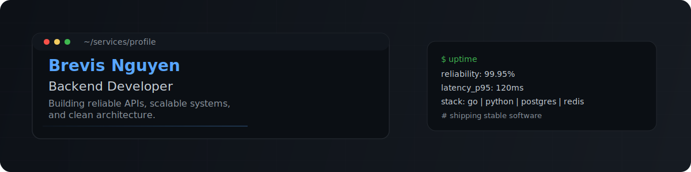

  

 

  

### Building reliable systems, one API at a time.

## Tech Stack

Go · Python · Java · TypeScript · Node.js · FastAPI · Spring Boot · PostgreSQL · Redis · MongoDB · Docker · Kubernetes · AWS

## About

I am a backend developer focused on system design, scalable APIs, performance optimization, and reliability engineering.
I enjoy building production-grade services with clear architecture, strong observability, and maintainable code.
My current interests include distributed systems, event-driven architecture, and cloud-native operations.

## Contact

---

  "Great backend engineering is invisible when done right: reliable, fast, and boring in production."

